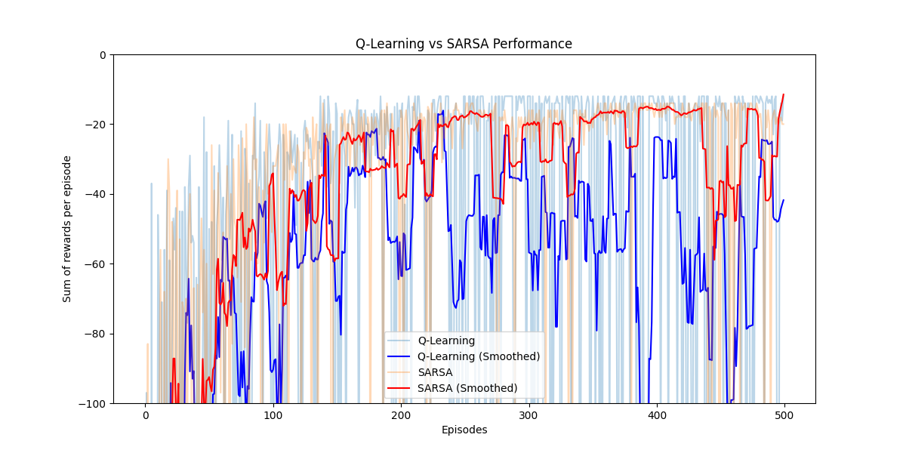
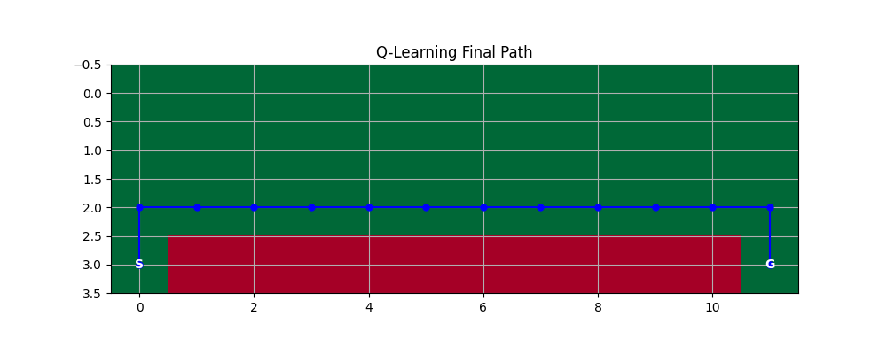
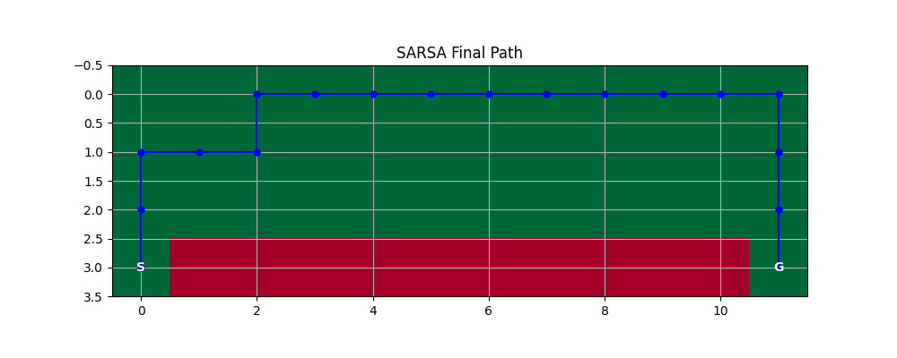

# NCHU Deep RL Homework 04: Q-Learning vs SARSA

This repository contains the implementation and analysis of two classic reinforcement learning algorithms: **Q-learning** and **SARSA**, applied to the **Cliff Walking** Gridworld environment.

## 📝 Assignment Objectives
- Implement Q-learning (Off-policy) and SARSA (On-policy).
- Analyze learning behavior, convergence, and risk-taking strategies.
- Compare safety versus optimality in the Cliff Walking environment.

---

## 🏗️ Project Architecture
- `cliff_walking.py`: Custom Gridworld environment (4x12) with cliff penalty (-100).
- `agents.py`: Modular RL agents implementing Temporal Difference (TD) updates.
- `main.py`: Training loop and visualization suite.
- `scripts/`: Automation scripts for session management (startup/ending).
- `openspec/`: Specification-driven development configuration.

---

## 📊 Results & Comparison

### 1. Training Performance
The plot below compares the cumulative reward per episode for both algorithms over 500 episodes.



> **Analysis**: SARSA (On-policy) is more stable and achieves higher rewards during training because it accounts for the potential penalties of exploration steps. Q-learning (Off-policy) assumes optimal future play, leading to more frequent falls during the exploration phase.

### 2. Learned Strategies
After training, we visualized the paths taken by the agents using a greedy policy ($\epsilon=0$).

#### Q-Learning Final Path (Optimal/Risky)

*Q-learning learns the shortest possible path right next to the cliff. While mathematically optimal, it leaves no room for error.*

#### SARSA Final Path (Safe/Conservative)

*SARSA learns a safer path that keeps a distance from the cliff edge, demonstrating its tendency to avoid high-penalty regions during on-policy learning.*

---

## 🔄 Workflow System (OpenSpec)
This project uses the **OpenSpec** framework for synchronized development and handover management.

### Commands:
- **`npm run dev:start`**: Syncs code, reads the latest `handover.md`, and initializes the environment.
- **`npm run dev:ending`**: Summarizes the session, updates the handover doc, and pushes progress to GitHub.

---

## 🚀 How to Run
1. **Experiment**:
   ```bash
   python main.py
   ```
2. **Start Development Session**:
   ```bash
   npm run dev:start
   ```
3. **End Development Session**:
   ```bash
   npm run dev:ending
   ```
